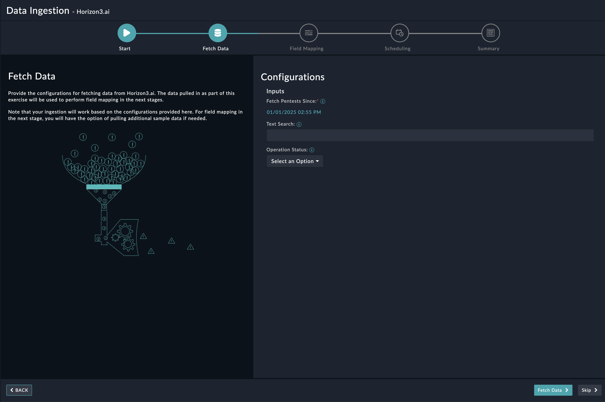
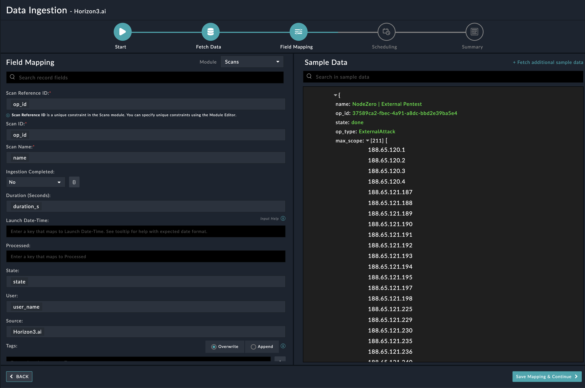
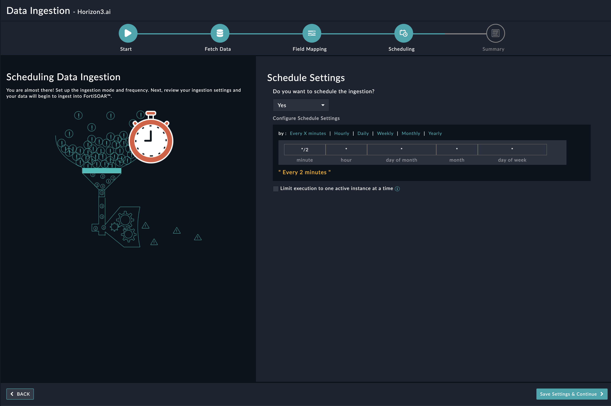
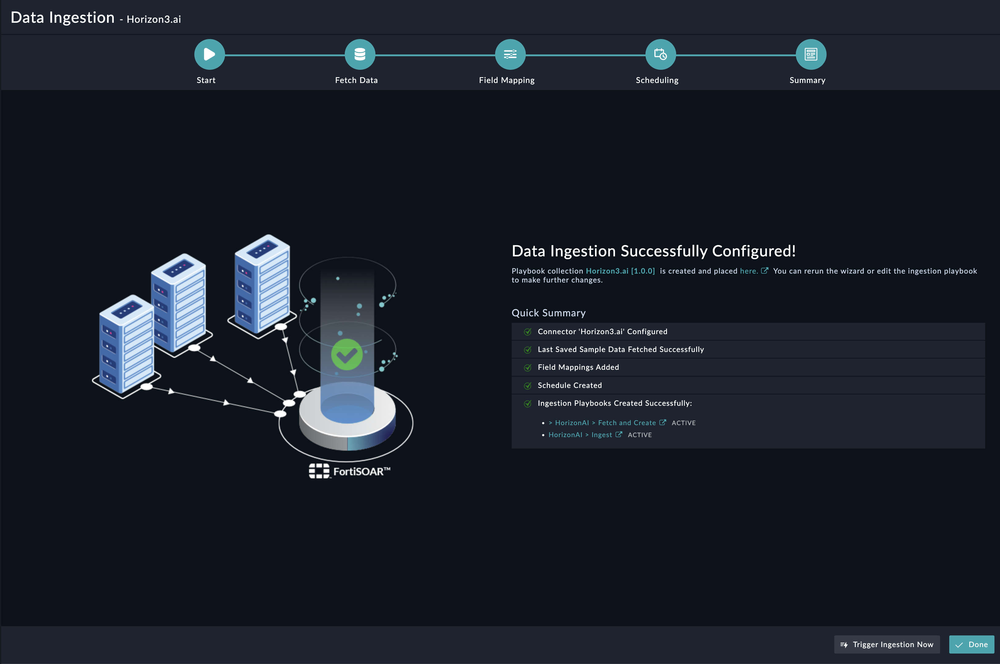

## About the connector
Horizon3.ai is a cybersecurity company specializing in automated security solutions. Their flagship product, NodeZero, is an autonomous penetration testing platform that simulates real-world cyberattacks to identify vulnerabilities and provide actionable remediation insights. Designed for ease of use, NodeZero empowers organizations to continuously assess and improve their security posture without relying heavily on manual intervention. It supports cloud, on-premise, and hybrid environments, making it adaptable to diverse IT setups.

This document provides information about the Horizon3.ai Connector, which facilitates automated interactions, with a Horizon3.ai server using FortiSOAR&trade; playbooks. Add the Horizon3.ai Connector as a step in FortiSOAR&trade; playbooks and perform automated operations with Horizon3.ai.

### Version information

Connector Version: 1.0.0

Authored By: Fortinet SE

Certified: No
## Installing the connector

From FortiSOAR&trade; 5.0.0 onwards, use the <strong>Connector Store</strong> to install the connector. For the detailed procedure to install a connector, click <a href="https://docs.fortinet.com/document/fortisoar/0.0.0/installing-a-connector/1/installing-a-connector" target="_top">here</a>. You can also use the following <code>yum</code> command as a root user to install connectors from an SSH session:

`yum install cyops-connector-horizonAi`

## Prerequisites to configuring the connector
- You must have the URL of Horizon3.ai server to which you will connect and perform automated operations and credentials to access that server.
- The FortiSOAR&trade; server should have outbound connectivity to port 443 on the Horizon3.ai server.

## Minimum Permissions Required
- N/A

## Configuring the connector
For the procedure to configure a connector, click [here](https://docs.fortinet.com/document/fortisoar/0.0.0/configuring-a-connector/1/configuring-a-connector)
### Configuration parameters

In FortiSOAR&trade;, on the Connectors page, click the <strong>Horizon3.ai</strong> connector row (if you are in the <strong>Grid</strong> view on the Connectors page) and in the <strong>Configurations&nbsp;</strong> tab enter the required configuration details:&nbsp;

<table border=1><thead><tr><th>Parameter </th><th>Description </th></tr></thead><tbody><tr><td>Server URL </td><td>Specify Horizon.ai GraphQL API endpoint to connect and perform automated operations. 
<tr><td>API Token </td><td>Specify the bearer token for API authentication. 
<tr><td>Verify SSL </td><td>Specifies whether the SSL certificate for the server is to be verified or not.  By default, this option is set as True. </td></tr>
</tbody></table>

## Actions supported by the connector
The following automated operations can be included in playbooks and you can also use the annotations to access operations from FortiSOAR&trade; release 4.10.0 and onwards:
<table border=1><thead><tr><th>Function </th><th>Description </th><th>Annotation and Category </th></tr></thead><tbody><tr><td>Get Pentests </td><td>Retrieves pentests based on the filters provided. </td><td>get_pentests  Investigation </td></tr>
<tr><td>Get Attack Paths </td><td>Retrieve attack paths for a specific pentest. </td><td>get_attack_paths  Investigation </td></tr>
<tr><td>Get Weaknesses </td><td>Retrieve weaknesses for a specific pentest. </td><td>get_weaknesses  Investigation </td></tr>
</tbody></table>

### operation: Get Pentests
#### Input parameters
<table border=1><thead><tr><th>Parameter </th><th>Description </th></tr></thead><tbody><tr><td>Text Search </td><td>Specify text to search across all text columns. 
</td></tr><tr><td>Sort By </td><td>Specify the field to sort the results. 
</td></tr><tr><td>Sort Direction </td><td>Specify the direction to sort results. 
</td></tr><tr><td>Date Filter Field </td><td>Select the date field to which the date range filters should be applied. 
</td></tr><tr><td>Date From </td><td>Filters results from this date 
</td></tr><tr><td>Date To </td><td>Filter results until this date 
</td></tr><tr><td>Operation Status </td><td>Filters the result by operation status. 
</td></tr><tr><td>Client Name </td><td>Specify the client name to filter the results. 
</td></tr><tr><td>Include Attack Paths </td><td>Specify whether to include attack paths in the response. 
</td></tr><tr><td>Include Weaknesses </td><td>Specify whether to weaknesses in the response. 
</td></tr><tr><td>Page Number </td><td>Specify the page number to retrieve specific page data. 
</td></tr><tr><td>Page Size </td><td>Specify the number of records or items to be retrieved per page. 
</td></tr></tbody></table>

#### Output
The output contains the following populated JSON schema:
<code> {
</code><code> &nbsp;&nbsp;&nbsp;&nbsp;    "pentests_page": {
</code><code> &nbsp;&nbsp;&nbsp;&nbsp;&nbsp;&nbsp;&nbsp;&nbsp;        "pentests": [],
</code><code> &nbsp;&nbsp;&nbsp;&nbsp;&nbsp;&nbsp;&nbsp;&nbsp;        "page_info": {
</code><code> &nbsp;&nbsp;&nbsp;&nbsp;&nbsp;&nbsp;&nbsp;&nbsp;&nbsp;&nbsp;&nbsp;&nbsp;            "page_size": "",
</code><code> &nbsp;&nbsp;&nbsp;&nbsp;&nbsp;&nbsp;&nbsp;&nbsp;&nbsp;&nbsp;&nbsp;&nbsp;            "end_cursor": "",
</code><code> &nbsp;&nbsp;&nbsp;&nbsp;&nbsp;&nbsp;&nbsp;&nbsp;&nbsp;&nbsp;&nbsp;&nbsp;            "has_next_page": "",
</code><code> &nbsp;&nbsp;&nbsp;&nbsp;&nbsp;&nbsp;&nbsp;&nbsp;&nbsp;&nbsp;&nbsp;&nbsp;            "total_count": ""
</code><code> &nbsp;&nbsp;&nbsp;&nbsp;&nbsp;&nbsp;&nbsp;&nbsp;        }
</code><code> &nbsp;&nbsp;&nbsp;&nbsp;    }
</code><code> }</code>
### operation: Get Attack Paths
#### Input parameters
<table border=1><thead><tr><th>Parameter </th><th>Description </th></tr></thead><tbody><tr><td>Operation ID </td><td>Specify pentest operation ID 
</td></tr><tr><td>Page Number </td><td>Specify the page number to retrieve specific page data. 
</td></tr><tr><td>Page Size </td><td>Specify the number of records or items to be retrieved per page 
</td></tr></tbody></table>

#### Output
The output contains the following populated JSON schema:
<code> {
</code><code> &nbsp;&nbsp;&nbsp;&nbsp;    "attack_paths_page": {
</code><code> &nbsp;&nbsp;&nbsp;&nbsp;&nbsp;&nbsp;&nbsp;&nbsp;        "attack_paths": [],
</code><code> &nbsp;&nbsp;&nbsp;&nbsp;&nbsp;&nbsp;&nbsp;&nbsp;        "page_info": {
</code><code> &nbsp;&nbsp;&nbsp;&nbsp;&nbsp;&nbsp;&nbsp;&nbsp;&nbsp;&nbsp;&nbsp;&nbsp;            "page_size": 0,
</code><code> &nbsp;&nbsp;&nbsp;&nbsp;&nbsp;&nbsp;&nbsp;&nbsp;&nbsp;&nbsp;&nbsp;&nbsp;            "end_cursor": "",
</code><code> &nbsp;&nbsp;&nbsp;&nbsp;&nbsp;&nbsp;&nbsp;&nbsp;&nbsp;&nbsp;&nbsp;&nbsp;            "has_next_page": "",
</code><code> &nbsp;&nbsp;&nbsp;&nbsp;&nbsp;&nbsp;&nbsp;&nbsp;&nbsp;&nbsp;&nbsp;&nbsp;            "total_count": 0
</code><code> &nbsp;&nbsp;&nbsp;&nbsp;&nbsp;&nbsp;&nbsp;&nbsp;        }
</code><code> &nbsp;&nbsp;&nbsp;&nbsp;    }
</code><code> }</code>
### operation: Get Weaknesses
#### Input parameters
<table border=1><thead><tr><th>Parameter </th><th>Description </th></tr></thead><tbody><tr><td>Operation ID </td><td>Specify the pentest operation ID 
</td></tr><tr><td>Page Number </td><td>Specify the page number to retrieve specific page data. 
</td></tr><tr><td>Page Size </td><td>Specify the number of records or items to be retrieved per page. 
</td></tr></tbody></table>

#### Output
The output contains the following populated JSON schema:
<code> {
</code><code> &nbsp;&nbsp;&nbsp;&nbsp;    "weaknesses_page": {
</code><code> &nbsp;&nbsp;&nbsp;&nbsp;&nbsp;&nbsp;&nbsp;&nbsp;        "weaknesses": [],
</code><code> &nbsp;&nbsp;&nbsp;&nbsp;&nbsp;&nbsp;&nbsp;&nbsp;        "page_info": {
</code><code> &nbsp;&nbsp;&nbsp;&nbsp;&nbsp;&nbsp;&nbsp;&nbsp;&nbsp;&nbsp;&nbsp;&nbsp;            "page_size": "",
</code><code> &nbsp;&nbsp;&nbsp;&nbsp;&nbsp;&nbsp;&nbsp;&nbsp;&nbsp;&nbsp;&nbsp;&nbsp;            "end_cursor": "",
</code><code> &nbsp;&nbsp;&nbsp;&nbsp;&nbsp;&nbsp;&nbsp;&nbsp;&nbsp;&nbsp;&nbsp;&nbsp;            "has_next_page": "",
</code><code> &nbsp;&nbsp;&nbsp;&nbsp;&nbsp;&nbsp;&nbsp;&nbsp;&nbsp;&nbsp;&nbsp;&nbsp;            "total_count": ""
</code><code> &nbsp;&nbsp;&nbsp;&nbsp;&nbsp;&nbsp;&nbsp;&nbsp;        }
</code><code> &nbsp;&nbsp;&nbsp;&nbsp;    }
</code><code> }</code>
## Included playbooks
The `Sample - horizonAi - 1.0.0` playbook collection comes bundled with the Horizon3.ai connector. These playbooks contain steps using which you can perform all supported actions. You can see bundled playbooks in the **Automation** > **Playbooks** section in FortiSOARTM after importing the Horizon3.ai connector.

- > HorizonAI > Fetch and Create
- >> HorizonAI >> Create Vulnerability
- Get Attack Paths
- Get Pentests
- Get Weaknesses
- HorizonAI > Ingest

**Note**: If you are planning to use any of the sample playbooks in your environment, ensure that you clone those playbooks and move them to a different collection, since the sample playbook collection gets deleted during connector upgrade and delete.
## Data Ingestion Support

## Data Ingestion Support

Use the Data Ingestion Wizard to easily ingest data into FortiSOAR™ by pulling data from Horizon3.ai. Currently, "Pentest" in Horizon3.ai are mapped to "scans" in FortiSOAR™. For more information on the Data Ingestion Wizard, see the "Connectors Guide" in the FortiSOAR™ product documentation. 

Configure Data Ingestion
You can configure data ingestion using the “Data Ingestion Wizard” to seamlessly map the incoming Horizon3.ai "Pentest" to FortiSOAR™ "Scans".

The Data Ingestion Wizard enables you to configure scheduled pulling of data from Horizon3.ai into FortiSOAR™. It also lets you pull some sample data from Horizon3.ai using which you can define the mapping of data between Horizon3.ai and FortiSOAR™. The mapping of common fields is generally already done by the Data Ingestion Wizard; users mostly require to only map any custom fields that are added to the Horizon3.ai pentest. 

1.   To begin configuring data ingestion, click Configure Data Ingestion on the Horizon3.ai connector’s "Configurations" page. 
Click Let’s Start by fetching some data, to open the “Fetch Sample Data” screen.

Sample data is required to create a field mapping between the Horizon3.ai pentest data and FortiSOAR™. The sample data is pulled from connector actions or ingestion playbooks.
2.  On the Fetch Data screen, provide the configurations required to fetch pentest from Horizon3.ai. The fetched data is used to create a mapping between the Horizon3.ai data and FortiSOAR™ scans. 

Once you have completed specifying the configurations, click Fetch Data.
3.  On the Field Mapping screen, map the fields of the Horizon3.ai pentest to the fields present in FortiSOAR™ scan module. To map a field, click the key in the sample data to add the “jinja” value of the field.

For more information on field mapping, see the Data Ingestion chapter in the "Connectors Guide" in the FortiSOAR™ product documentation. Once you have completed mapping fields, click Save Mapping & Continue.
4.  Use the Scheduling screen to configure schedule-based ingestion, i.e., specify the polling frequency to Horizon3.ai, so that the content gets pulled from Horizon3.ai integration into FortiSOAR™. On the Scheduling screen, from the Do you want to schedule the ingestion? drop-down list, select Yes. In the “Configure Schedule Settings” section, specify the Cron expression for the schedule. For example, if you want to pull data from Horizon3.ai every 5 minutes, click Every X Minute, and in the minute box enter */5. This would mean that based on the configuration you have set up, data, i.e., pentest will be pulled from Horizon3.ai every 5 minutes.

Once you have completed scheduling, click Save Settings & Continue.
5.  The Summary screen displays a summary of the mapping done, and it also contains links to the Ingestion playbooks. Click Done to complete the data ingestion and exit the Data Ingestion Wizard.

